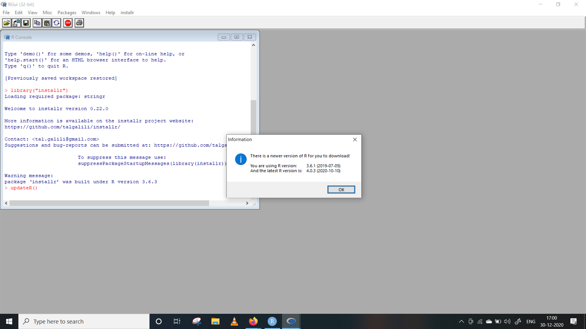
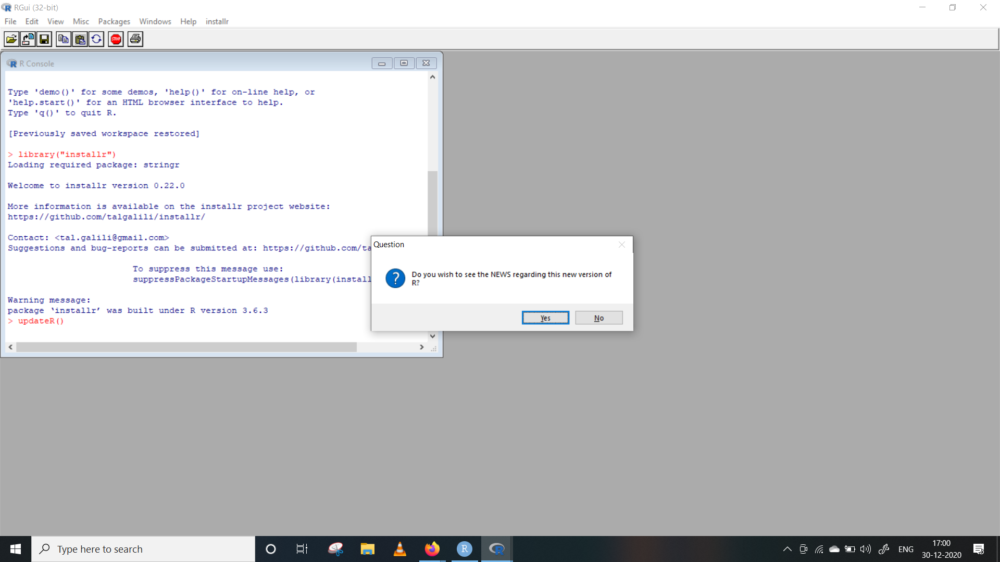
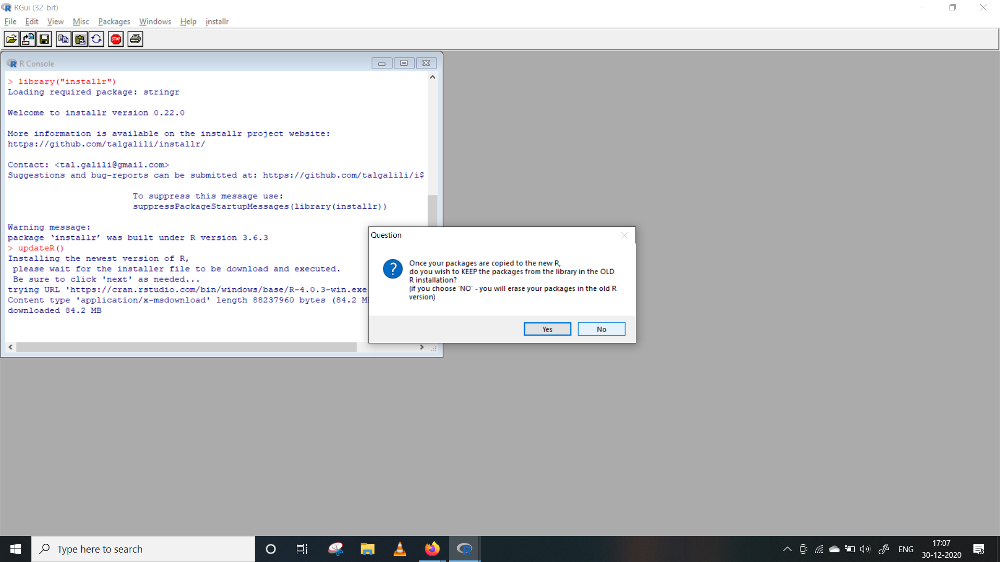
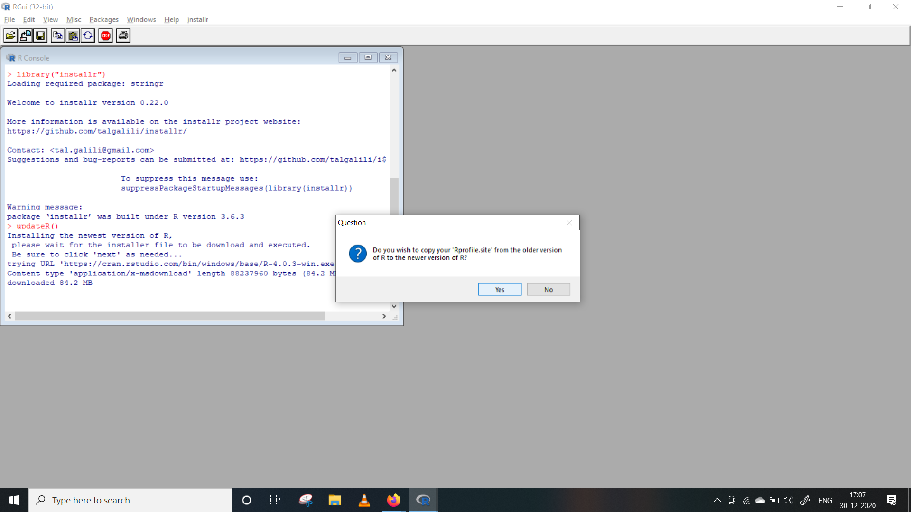
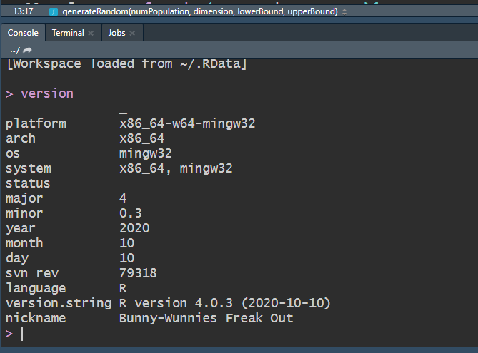
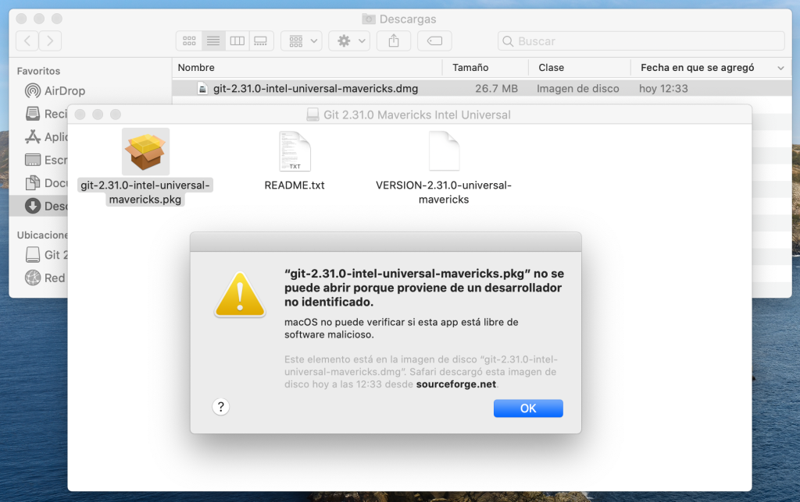
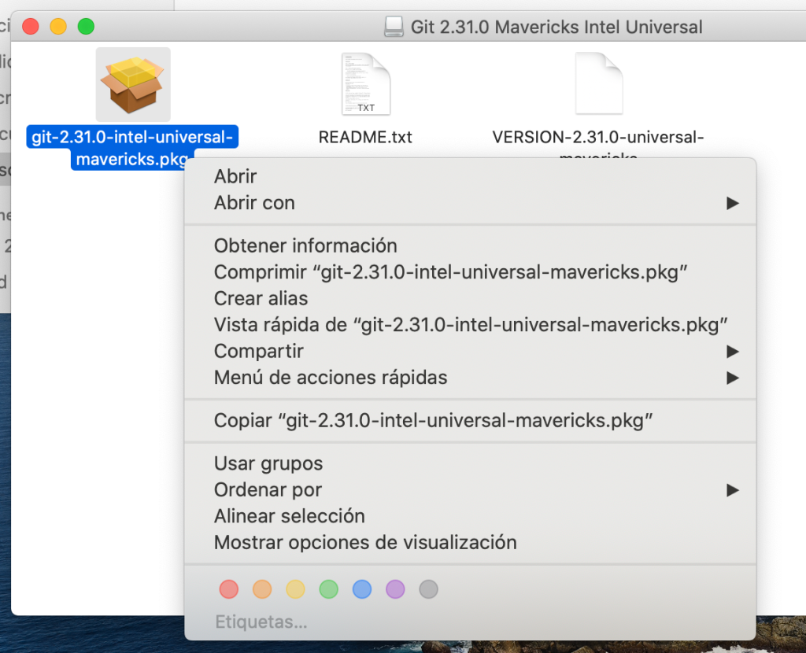
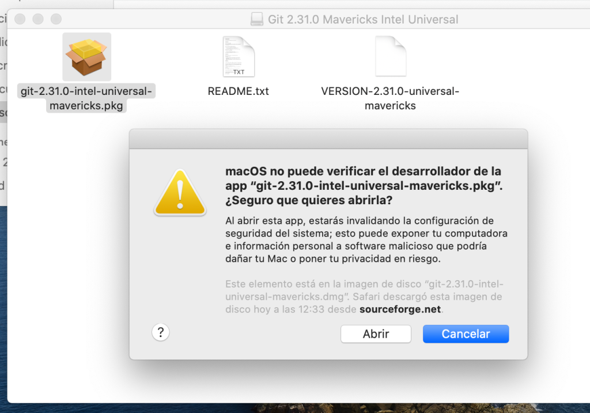
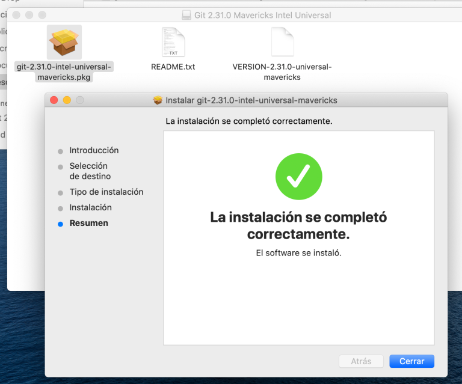

```{r setup, include=FALSE}
knitr::opts_chunk$set(echo = FALSE)
```

# Guía de instalación del sofware R y RStudio

## Introducción

El objetivo de esta guía es detallar el proceso de instalación de R y su IDE, RStudio, y familiarizar al usuario con el entorno de trabajo que proporciona RStudio.

## Instalar R

Para instalar R nos dirigiremos a la página web de R project. Para ello haremos click en el siguiente enlace: <http://www.r-project.org>.

[{width="800"}](https://www.r-project.org/)

Para descargar el software haremos click en **CRAN** y luego sobre el enlace del "espejo" (mirror) más próximo a nuestra ubicación.

[{width="870"}](https://cran.r-project.org/mirrors.html)

Luego debemos seleccionar la versión de R para el sistema operativo que esté utilizando, Windows o Mac OS

[{width="878"}](https://cran.dcc.uchile.cl/)

### Instalar R en Windows

Al hacer clic sobre "Download R for Windows" sremos dirigidos a la página que se reproduce a continuación. Allí haremos clic sobre **install R for the first time**.


En la siguiente ventana, haremos clic sobre **Download R 4.0.3 for Windows** y guardar el archivo de instalación.

Luego, ejecutaremos el archivo descargado para proceder a la instalación de R y seguiremos las instrucciones del ejecutable.

### ¿Cómo actualizar la instalación de R en Windows?

**Paso 1**: Verifique su versión de instalación existente dirigiéndose a
RStudio y escribiendo la versión en la consola. Esto debería darle la
información sobre sus versiones principales y secundarias instaladas de
R. Algo como esto:

```{r echo=TRUE, eval = FALSE}

version

```

**Paso 2**: Dirígete a RGui (recuerda que no vayas a RStudio, busca RGui en el
menú de inicio de Windows). Instale y cargue un paquete llamado
installr, usando estos comandos:

```{r echo=TRUE, eval = FALSE}

# Install the *installr* package
install.packages("installr")
  
# Load the package
library("installr")

```

**Paso 3**: Simplemente ejecute el comando installr :: updateR () y espere a que aparezca el cuadro de diálogo de información.

```{r echo=TRUE, eval = FALSE}

# The below command will check your 
# installed version against the latest 
# version available and will show you 
# an information dialogue box
installr::updateR()

```

{width="920"}

**Paso 4:** navegue por todos los procedimientos de instalación como se muestra a continuación:\
\
**Paso 4.1:** Si desea mantenerse libre de spam, presione No



Paso 4.2: haga clic en Sí, si desea actualizar su versión de instalación de R


Paso 4.3: A menos que tenga una instalación nueva y limpia, definitivamente haga clic en Sí


Paso 4.4: si no estaba trabajando en proyectos de producción en ese momento, presione No.



Paso 4.5: Esto está relacionado con RShiny. Haga clic en Sí.



Paso 4.6: Aunque los paquetes deberían tener compatibilidad con versiones anteriores, haga clic en Sí.


Paso 5: Una vez realizada toda la instalación, cierre su RGui y regrese a
RStudio y vuelva a ejecutar la versión del comando para verificar si su
instalación de R se ha actualizado o no.



### Instalar R en Mac

Lo primero es descargar el fostware, para ello haremos clic sobre **Download R for (Mac) OS X** y se nos dirigirá a la página que se reproduce más abajo. Luego, haremos clic sobre la versión de R en función de la versión del OS de cada uno.


Para descargar haremos click sobre **R-4.1.1.pkg** y guardaremos el archivo de instalación para luego ejecutarlo e instalar R.

## Instalar RStudio

Primero, debemos descargar RStudio desde su página web (<https://rstudio.com/products/rstudio/download/>) Allí seleccionamos la versión gratuita de RStudio Desktop

[](https://www.rstudio.com/products/rstudio/download/)

### Instalar RStudio en Windows

Luego, haremos click en el botón de descarga. Automáticamente se decargará un ejecutable para instalar RStudio. Se requiere de Windows 7 o superior.

### Instalar RStudio en Mac OS

Luego, haremos click en el botón de descarga. Automáticamente se decargará un ejecutable para instalar RStudio. Se requiere de Mac OS High Sierra o superior.

### Entorno de trabajo de RStudio

Al abrir RStudio deberíamos ver una pantalla similar a lo que se muestra en la siguiente imagen:


Una vez en RStudio, podemos escribir y ejecutar las órdenes de varias formas:

-   directamente en la consola

-   a través de un script (.R)

-   con archivos Rmarkdown (.Rmd)

Como podemos ver, RStudio está (normalmente) dividido en 4 paneles.

## Instalar Git 

Git es un sistema de control de versiones. Al ser un sistema de control de versiones, git hará un seguimiento de los archivos fuente que son necesarios para construir un proyecto que estemos editando. De tal manera que se se añade un fichero (conjunto de archivos), se modifica o se borra, git guardará en un registro interno cada uno de los cambios. Esto permite poder consultar el estado del proyecto en una determinada fecha, pudiéndolo recuperar tal y como estaba, aunque se hubieran borrado ficheros. Que sea un sistema distribuido significa que cada copia del proyecto contiene todo el histórico completo, hasta el momento en que se hizo la copia.

### Cómo instalar Git en Ubuntu

La instalación de git en Ubuntu no puede ser más fácil. Sólo hay que abrir un terminal de comandos y ejecutar apt para que se descargue el paquete de los repositorios oficiales y configure el sistema para dejarlo disponible.

Para ello instalaremos git y verificaremos que puede ejecutarse sin problemas:

```{bash  bash2, echo=TRUE, eval = FALSE}

sudo apt install git

# confirmación del comando

git --version

```

### Instalar Git para Windows

Sólo debe descargarse el instalador correspondiente desde la página oficial del proyecto Git y descargar el instalador correspondiente al sistema operativo usado teniendo en cuenta la arquitectura de nuestro sistema: 32 o 64bits.

[{width="890"}](https://git-scm.com/)

El instalador para Windows abrirá un asistente que mostrará una serie
de opciones durante el proceso. No debe preocuparse y dejar las
opciones marcadas por defecto que serán suficientes en la mayoría de las
situaciones.

Una vez terminado, puedes marcar la opción Iniciar Git Bash si quieres
abrir una línea de comandos de Bash o si has seleccionado la línea de
comandos de Windows que ejecuta Git desde la línea de comandos de
Windows. Compruebe la instalación ejecutando git de prueba con:

```{bash bash3, echo=TRUE, eval = FALSE}

git --version

```

### Instalar Git para MAC

Primero te vas a [este enlace](https://git-scm.com/download/mac), en la sección de **Binary Installer**, seleccionas la última versión indicada, en este ejemplo es la **2.33.0**

[{width="917"}](https://git-scm.com/download/mac)

Una vez descargado en tu computadora, solo le das doble clic al archivo **`git-2.33.0-intel-universal-mavericks.dmg`** mostrado en la imagen de abajo. Se abrirá una carpeta con un archivo del mismo nombre, pero con extensión **`pkg`**, y lo abrimos.

Si te sale el siguiente mensaje es porque la fuente de este paquete no
está registrada como una fuente de confianza. Esto es una configuración
predeterminada de macOS.



Para brincarnos fácilmente esta configuración porque git realmente si es de confianza, basta con presionar **`Ctrl + Clic`** y seleccionamos abrir.



Ahora simplemente le decimos que efectivamente si lo queremos ejecutar presionando este otro botón `abrir`.



Ya dentro del instalador solo le decimos que continué hasta que termine la instalación.



Ahora verificamos en la terminal que Git está instalado, usando el comando **`git --version`**.

```{bash bash4, echo=TRUE, eval = FALSE}

git --version

```

### 

## Configuración inicial de Git recomendada

Es recomendado configurar git para empezar a trabajar con él, esto te
ayuda a registrar tus cambios y versiones con tu información personal.

Para establecer la configuración con tu nombre y correo electrónico vamos a usar el comando `git config`.

```{bash bash5, echo=TRUE, eval = FALSE}

$ git config --global user.name "Aquí tu nombre"

$ git config --global user.emil "AquiVaTuEamil@email.com"

```

Para verificar que la configuración se realizó correctamente utiliza este comando.

`$ git config –list`

Deberá imprimir en la terminal las configuraciones, entre ellas las que acabamos de actualizar.

```{bash bash6, echo=TRUE, eval = FALSE}

core.excludeFiles=~/.gitignore
color.interactive=true
...
user.email=AquiVaTuEamil@email.com
user.name=Aquí tu nombre
...
```

### Y listo, con esto ya deberías tener **git** instalado en tu sistema operativo y poder trabajar en tus proyectos.
