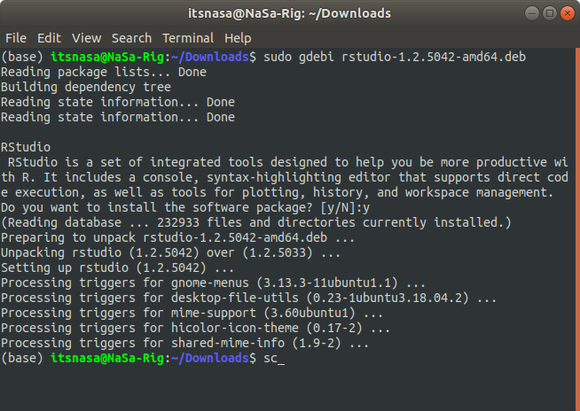

```{r setup, include=FALSE}
knitr::opts_chunk$set(echo = FALSE)
```

# Guía de instalación del sofware R y RStudio

## 1. Introducción

El objetivo de esta guía es detallar el proceso de instalación de R y su [IDE](https://en.wikipedia.org/wiki/Integrated_development_environment)), RStudio, y familiarizar al usuario con el entorno de trabajo que proporciona RStudio.

## 2. Instalar R

Para instalar R nos dirigiremos a la página web de R project. Para ello haremos click en el siguiente enlace: <http://www.r-project.org>.

[{width="800"}](https://www.r-project.org/)

Para descargar el software haremos click en **CRAN** y luego sobre el enlace del "espejo" (mirror) más próximo a nuestra ubicación.

[{width="870"}](https://cran.r-project.org/mirrors.html)

Luego debemos seleccionar la versión de R para el sistema operativo que esté utilizando, Windows o Mac OS

[{width="878"}](https://cran.dcc.uchile.cl/)

### 2.1 Instalar R en **Ubuntu**

Paquete para la actual R 4.1. release \* están disponibles para la mayoría de las versiones de escritorio estables de Ubuntu hasta su fecha de finalización oficial. Sin embargo, solo la última versión de Long Term Support (LTS) es totalmente compatible. A partir del 19 de mayo de 2021, las versiones compatibles son:

-   Hirsute Hippo (21.04, amd64 only)

-   Groovy Gorilla (20.10, amd64 only),

-   Focal Fossa (20.04; LTS and amd64 only),

-   Bionic Beaver (18.04; LTS), and

-   Xenial Xerus (16.04; LTS).

Tenga en cuenta que para instalar paquetes de R 4.1, se necesita una entrada nueva y diferente sources.list. Consulte los detalles a continuación.\
\
Para versiones anteriores de R, consulte el archivo [corresponding README](https://cran.r-project.org/bin/linux/ubuntu/olderreleasesREADME.html).

### Paquetes CRAN adicionales

Para paquetes binarios adicionales para R (actualmente más de 4000+), consulte los diferentes PPA de CRAN2deb4ubuntu. Para R 4.1. \*, Esto es <https://launchpad.net/~c2d4u.team/+archive/ubuntu/c2d4u4.0+>

El repositorio 'c2d4u' solo está disponible para las versiones LTS. Si desea intentar usar el repositorio con una versión que no sea LTS, puede editar manualmente la 'c2d4u_team-ubuntu-c2d4u4_0 \_- \*. List' para usar focal en lugar de la versión prevista. Este uso del repositorio 'c2d4u' no es compatible. Se recomienda encarecidamente una versión LTS para utilizar el repositorio 'c2d4u'.

### Instalación

Para obtener los últimos paquetes de R 4.1, agregue una entrada como

```{bash echo=TRUE, eval = FALSE}

deb https://cloud.r-project.org/bin/linux/ubuntu hirsute-cran40/

```

o

```{bash echo=TRUE, eval = FALSE}

deb https://cloud.r-project.org/bin/linux/ubuntu focal-cran40/

```

o

```{bash echo=TRUE, eval = FALSE}

deb https://cloud.r-project.org/bin/linux/ubuntu groovy-cran40/

```

o

```{bash echo=TRUE, eval = FALSE}

deb https://cloud.r-project.org/bin/linux/ubuntu bionic-cran40/
```

o

```{bash echo=TRUE, eval = FALSE}

deb https://cloud.r-project.org/bin/linux/ubuntu xenial-cran40/
```

En su archivo /etc/apt/sources.list. Al utilizar <https://cloud.r-project.org,> se le redirigirá automáticamente a un espejo CRAN cercano. Consulte <https://cran.r-project.org/mirrors.html> para obtener la lista actual de espejos CRAN.

Para instalar el sistema R completo, use:

```{bash echo=TRUE, eval = FALSE}

sudo apt-get update
sudo apt-get install r-base
```

Usuarios que necesitan compilar paquetes R desde la fuente [p. Ej. los mantenedores de paquetes, o cualquier persona que instale paquetes con install.packages ()] también debe instalar el paquete r-base-dev:

```{bash echo=TRUE, eval = FALSE}

sudo apt-get install r-base-dev

```

Por lo demás, los paquetes R para Ubuntu se comportan como los de Debian. Se puede encontrar información adicional en el archivo README de Debian ubicado en <https://cran.R-project.org/bin/linux/debian/.>\
\
La instalación y compilación de R o algunos de sus paquetes pueden requerir paquetes de Ubuntu de los repositorios 'backports'. Por lo tanto, se sugiere activar los repositorios de backports con una entrada como:

```{bash echo=TRUE, eval = FALSE}

deb https://<my.favorite.ubuntu.mirror>/ focal-backports main restricted universe
```

en su archivo /etc/apt/sources.list. Consulte <https://launchpad.net/ubuntu/+archivemirrors> para ver la lista de espejos de Ubuntu.

### Usando apt-key

Los archivos de Ubuntu en CRAN están firmados con la clave "Michael Rutter marutter\@gmail.com" con el ID de clave 0x51716619e084dab9. Para agregar la clave a su sistema con un comando, use (gracias a Brett Presnell por la sugerencia):

```{bash echo=TRUE, eval = FALSE}

sudo apt-key adv --keyserver keyserver.ubuntu.com --recv-keys E298A3A825C0D65DFD57CBB651716619E084DAB9
```

Se puede utilizar un método alternativo recuperando la clave con

```{bash echo=TRUE, eval = FALSE}

gpg --keyserver keyserver.ubuntu.com --recv-key E298A3A825C0D65DFD57CBB651716619E084DAB9
```

y luego alimentarlo a apt-key con

```{bash echo=TRUE, eval = FALSE}

gpg -a --export E298A3A825C0D65DFD57CBB651716619E084DAB9 | sudo apt-key add -
```

Algunas personas han informado de dificultades para utilizar este enfoque. El problema generalmente está relacionado con un firewall que bloquea el puerto 11371. Si el primer comando gpg falla, puede intentarlo (gracias a Mischan Toosarani por el consejo):

```{bash echo=TRUE, eval = FALSE}

gpg --keyserver hkp://keyserver.ubuntu.com:80 --recv-keys E298A3A825C0D65DFD57CBB651716619E084DAB9
```

y luego alimentarlo a apt-key con

```{bash echo=TRUE, eval = FALSE}

gpg -a --export E298A3A825C0D65DFD57CBB651716619E084DAB9 | sudo apt-key add -

```

Otro enfoque alternativo es buscar la clave en <http://keyserver.ubuntu.com:11371/> y copiar la clave en un archivo de texto sin formato, digamos key.txt. Luego, ingrese la clave a apt-key con

```{bash echo=TRUE, eval = FALSE}

sudo apt-key add key.txt
```

### 2.2 Instalar R en Windows

Al hacer clic sobre "Download R for Windows" sremos dirigidos a la página que se reproduce a continuación. Allí haremos clic sobre **install R for the first time**.


En la siguiente ventana, haremos clic sobre **Download R 4.1.1 for Windows** y guardar el archivo de instalación.

[{width="900"}](https://cran.r-project.org/bin/windows/base/)

Luego, ejecutaremos el archivo descargado para proceder a la instalación de R y seguiremos las instrucciones del ejecutable.

### ¿Cómo actualizar la instalación de R en Windows?

**Paso 1**: Verifique su versión de instalación existente dirigiéndose a RStudio y escribiendo la versión en la consola. Esto debería darle la información sobre sus versiones principales y secundarias instaladas de R. Algo como esto:

```{r echo=TRUE, eval = FALSE}

version

```

**Paso 2**: Dirígete a RGui (recuerda que no vayas a RStudio, busca RGui en el menú de inicio de Windows). Instale y cargue un paquete llamado installr, usando estos comandos:

```{r echo=TRUE, eval = FALSE}

# Install the *installr* package
install.packages("installr")
  
# Load the package
library("installr")

```

**Paso 3**: Simplemente ejecute el comando installr :: updateR () y espere a que aparezca el cuadro de diálogo de información.

```{r echo=TRUE, eval = FALSE}

# The below command will check your 
# installed version against the latest 
# version available and will show you 
# an information dialogue box
installr::updateR()

```

{width="920"}

**Paso 4:** navegue por todos los procedimientos de instalación como se muestra a continuación:\
\
**Paso 4.1:** Si desea mantenerse libre de spam, presione No


Paso 4.2: haga clic en Sí, si desea actualizar su versión de instalación de R


Paso 4.3: A menos que tenga una instalación nueva y limpia, definitivamente haga clic en Sí


Paso 4.4: si no estaba trabajando en proyectos de producción en ese momento, presione No.


Paso 4.5: Esto está relacionado con RShiny. Haga clic en Sí.


Paso 4.6: Aunque los paquetes deberían tener compatibilidad con versiones anteriores, haga clic en Sí.


Paso 5: Una vez realizada toda la instalación, cierre su RGui y regrese a RStudio y vuelva a ejecutar la versión del comando para verificar si su instalación de R se ha actualizado o no.


### 2.3 Instalar R en Mac

Lo primero es descargar el software, para ello haremos clic sobre **Download R for (Mac) OS X** y se nos dirigirá a la página que se reproduce más abajo. Luego, haremos clic sobre la versión de R en función de la versión del OS de cada uno.


Para descargar haremos click sobre **R-4.1.1.pkg** y guardaremos el archivo de instalación para luego ejecutarlo e instalar R.

## 3. Instalar RStudio

RStudio es un entorno de desarrollo integrado para el lenguaje de programación R, dedicado a la computación estadística y gráficos. Incluye una consola, editor de sintaxis que apoya la ejecución de código, así como herramientas para el trazado, la depuración y la gestión del espacio de trabajo.

Primero, debemos descargar RStudio desde su página web (<https://rstudio.com/products/rstudio/download/>) Allí seleccionamos la versión gratuita de RStudio Desktop

[](https://www.rstudio.com/products/rstudio/download/)

### Instalar RStudio en Ubuntu

### A través de la terminal

**Paso 1:** Abra la terminal (Ctrl + Alt + T) en Ubuntu.

**Paso 2:** actualice la caché de paquetes.

```{bash echo=TRUE, eval = FALSE}

sudo apt-get update

```

**Paso 3:** Descarga de R Studio en Ubuntu

Instale el paquete gdebi para instalar paquetes .deb fácilmente.

```{bash echo=TRUE, eval = FALSE}

sudo add-apt-repository universe
sudo apt-get install gdebi-core

```

**Paso 4:** Vaya a la [página de descargas de R Studio](https://www.rstudio.com/products/rstudio/download/#download) y seleccione el último paquete \* .deb disponible para Ubuntu 18 / Debian 10.

**Paso 5:** Vaya a la carpeta Descargas en la máquina local.

```{bash echo=TRUE, eval = FALSE}

$ cd Descargas/
$ ls
 rstudio-2021.09.0+351-amd64.deb

```

Paso 6: instalar usando el paquete gdebi.

```{bash echo=TRUE, eval = FALSE}

sudo gdebi rstudio-1.2.5042-amd64.deb

```



Alternativamente, RStudio también se puede instalar a través del software Ubuntu, pero el uso del enfoque anterior generalmente garantiza que se instale la última versión.

### Instalar RStudio en Windows

Luego, haremos click en el botón de descarga. Automáticamente se decargará un ejecutable para instalar RStudio. Se requiere de Windows 7 o superior.

### Instalar RStudio en Mac OS

Luego, haremos click en el botón de descarga. Automáticamente se decargará un ejecutable para instalar RStudio. Se requiere de Mac OS High Sierra o superior.

### Entorno de trabajo de RStudio

Al abrir RStudio deberíamos ver una pantalla similar a lo que se muestra en la siguiente imagen:


Una vez en RStudio, podemos escribir y ejecutar las órdenes de varias formas:

-   directamente en la consola

-   a través de un script (.R)

-   con archivos Rmarkdown (.Rmd)

Como podemos ver, RStudio está (normalmente) dividido en 4 paneles.

## 4. Instalar Git

Git es un sistema de control de versiones. Al ser un sistema de control de versiones, git hará un seguimiento de los archivos fuente que son necesarios para construir un proyecto que estemos editando. De tal manera que se se añade un fichero (conjunto de archivos), se modifica o se borra, git guardará en un registro interno cada uno de los cambios. Esto permite poder consultar el estado del proyecto en una determinada fecha, pudiéndolo recuperar tal y como estaba, aunque se hubieran borrado ficheros. Que sea un sistema distribuido significa que cada copia del proyecto contiene todo el histórico completo, hasta el momento en que se hizo la copia.

### Cómo instalar Git en Ubuntu

La instalación de git en Ubuntu no puede ser más fácil. Sólo hay que abrir un terminal de comandos y ejecutar apt para que se descargue el paquete de los repositorios oficiales y configure el sistema para dejarlo disponible.

Para ello instalaremos git y verificaremos que puede ejecutarse sin problemas:

```{bash  bash2, echo=TRUE, eval = FALSE}

sudo apt install git

# confirmación del comando

git --version

```

### Instalar Git para Windows

Sólo debe descargarse el instalador correspondiente desde la página oficial del proyecto Git y descargar el instalador correspondiente al sistema operativo usado teniendo en cuenta la arquitectura de nuestro sistema: 32 o 64bits.

[{width="890"}](https://git-scm.com/)

El instalador para Windows abrirá un asistente que mostrará una serie de opciones durante el proceso. No debe preocuparse y dejar las opciones marcadas por defecto que serán suficientes en la mayoría de las situaciones.

Una vez terminado, puedes marcar la opción Iniciar Git Bash si quieres abrir una línea de comandos de Bash o si has seleccionado la línea de comandos de Windows que ejecuta Git desde la línea de comandos de Windows. Compruebe la instalación ejecutando git de prueba con:

```{bash bash3, echo=TRUE, eval = FALSE}

git --version

```

### Instalar Git para MAC

Primero te vas a [este enlace](https://git-scm.com/download/mac), en la sección de **Binary Installer**, seleccionas la última versión indicada, en este ejemplo es la **2.33.0**

[{width="917"}](https://git-scm.com/download/mac)

Una vez descargado en tu computadora, solo le das doble clic al archivo **`git-2.33.0-intel-universal-mavericks.dmg`** mostrado en la imagen de abajo. Se abrirá una carpeta con un archivo del mismo nombre, pero con extensión **`pkg`**, y lo abrimos.

Si te sale el siguiente mensaje es porque la fuente de este paquete no está registrada como una fuente de confianza. Esto es una configuración predeterminada de macOS.


Para brincarnos fácilmente esta configuración porque git realmente si es de confianza, basta con presionar **`Ctrl + Clic`** y seleccionamos abrir.


Ahora simplemente le decimos que efectivamente si lo queremos ejecutar presionando este otro botón `abrir`.


Ya dentro del instalador solo le decimos que continué hasta que termine la instalación.


Ahora verificamos en la terminal que Git está instalado, usando el comando **`git --version`**.

```{bash bash4, echo=TRUE, eval = FALSE}

git --version

```

##### Y listo, con esto ya deberías tener **git** instalado en tu sistema operativo y poder trabajar en tus proyectos.

## 5 Bonus Track

### LaTeX (basico) para R Markdown

Latex es un sistema de composición de textos, orientado a la creación de documentos escritos que presenten una alta calidad tipográfica. Por sus características y posibilidades, es usado de forma especialmente intensa en la generación de artículos y libros científicos que incluyen, entre otros elementos, expresiones matemáticas.

LaTeX está formado por un gran conjunto de macros de TeX, escrito por Leslie Lamport en 1984, con la intención de facilitar el uso del lenguaje de composición tipográfica, TEX, creado por Donald Knuth. Es muy utilizado para la composición de artículos académicos, tesis y libros técnicos, dado que la calidad tipográfica de los documentos realizados en LaTeX, se considera adecuada a las necesidades de una editorial científica de primera línea, muchas de las cuales ya lo emplean.

### Instalación 

Vamos a instalar algunos paquetes de R para tener una version mínima de Latex que nos permita trabajar con R Markdown y hacer documentos dinamicos e introducirnos a la programaciñon en Latex, para esto instale los siguientes paquetes:

#### R Markdown

R Markdown es un formato que permite una fácil creación de documentos, presentaciones dinámicas y informes de R. Markdown es un formato de sintaxis simple para crear documentos en HTML, PDF, y Word. En el siguiente link pueden encontrar información de como se crean estos documentos <http://rmarkdown.rstudio.com>.

```{r echo=TRUE, eval = FALSE}

install.packages('rmarkdown', dependencies = TRUE)
library(rmarkdown)

```

#### Knitr

**knitr** una herramienta para generación de informes dinámico en R.^[1](https://es.wikipedia.org/wiki/Knitr#cite_note-1)^​^[2](https://es.wikipedia.org/wiki/Knitr#cite_note-2)^​ Es un paquete en el lenguaje de programación [estadístico](https://es.wikipedia.org/wiki/Estad%C3%ADstica "Estadística") [R](https://es.wikipedia.org/wiki/R_(lenguaje_de_programaci%C3%B3n) "R (lenguaje de programación)") que permite integrar R en documentos [LaTeX](https://es.wikipedia.org/wiki/LaTeX "LaTeX"), [LyX](https://es.wikipedia.org/wiki/LyX "LyX"), [HTML](https://es.wikipedia.org/wiki/HTML "HTML"), [Markdown](https://es.wikipedia.org/wiki/Markdown "Markdown"), [AsciiDoc](https://en.wikipedia.org/wiki/en:AsciiDoc "w:en:AsciiDoc"), y [reStructuredText](https://es.wikipedia.org/wiki/ReStructuredText "ReStructuredText"). El propósito de knitr es dar espacio a la [reproducibilidad](https://es.wikipedia.org/wiki/Reproducibilidad "Reproducibilidad") de investigación en R a través de [Programación Literaría.](https://es.wikipedia.org/wiki/Programaci%C3%B3n_literaria "Programación literaria") Está bajo la licencia [GNU Licencia Pública General](https://es.wikipedia.org/wiki/GNU_General_Public_License "GNU General Public License").

```{r echo=TRUE, eval = FALSE}

install.packages("knitr", dependencies = TRUE)

```

#### devtools package

El objetivo de devtools es facilitar el desarrollo de paquetes al proporcionar funciones R que simplifican y aceleran las tareas comunes. [R Packages](https://r-pkgs.org/) es un libro basado en este flujo de trabajo.

```{r echo=TRUE, eval = FALSE}

install.packages('devtools')
devtools::install_github('rstudio/rmarkdown')
```

#### tinytex package

Si desea crear documentos PDF desde R Markdown, necesitará tener instalada una distribución LaTeX. Aunque hay varias opciones tradicionales que incluyen MiKTeX, MacTeX y TeX Live, recomendamos que los usuarios de R Markdown instalen TinyTeX.

TinyTeX es una distribución LaTeX personalizada basada en TeX Live que tiene un tamaño relativamente pequeño, pero funciona bien en la mayoría de los casos, especialmente para los usuarios de R. La instalación o ejecución de TinyTeX no requiere privilegios de administrador de sistemas.1 Puede instalar TinyTeX con el paquete R tinytex (Xie 2021f):

```{r echo=TRUE, eval = FALSE}
install.packages("tinytex", dependencies = TRUE)
tinytex::install_tinytex()
```

```{r echo=TRUE, eval = FALSE}
devtools::install_github('yihui/tinytex')
tinytex::reinstall_tinytex() # reinstall it for a newer version
```

Tenga en cuenta que 'tinytex' se refiere al paquete R y 'TinyTeX' se refiere a la distribución LaTeX. Hay dos ventajas de usar TinyTeX:

TinyTeX es liviano (en comparación con otras distribuciones de LaTeX), multiplataforma y portátil. Por ejemplo, puede almacenar una copia de TinyTeX en su unidad USB u otros dispositivos portátiles y usarla en otras computadoras con el mismo sistema operativo.

Cuando R Markdown se convierte a PDF, Pandoc convierte primero Markdown en un documento LaTeX intermedio. El paquete R tinytex ha proporcionado funciones auxiliares para compilar documentos LaTeX en PDF (la función principal es tinytex :: latexmk ()). Si usa TinyTeX y se requieren ciertos paquetes de LaTeX pero no están instalados, tinytex intentará instalarlos automáticamente por usted. También intentará compilar el archivo LaTeX una cantidad suficiente de veces para asegurarse de que se resuelvan todas las referencias cruzadas.

Si está interesado en los detalles técnicos, puede consultar el artículo Xie (2019) y la página de preguntas frecuentes en <https://yihui.org/tinytex/faq/.>
