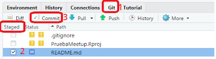

```{r setup, include=FALSE}
knitr::opts_chunk$set(echo = FALSE)
```

# Cómo usar Git/GitHub con R

El uso de Git y GitHub junto con RStudio tiene el poder de revolucionar la forma en que trabajas en R. Pero configurar todo puede ser un desafío.

## 1. ¿Qué es Git? ¿Qué es GitHub?

En primer lugar, son dos cosas separadas:

1.  Git es un software de código abierto para el control de versiones. Utilizando Git, puedes hacer cosas como ver todas las versiones anteriores de código que has creado en un proyecto.

2.  GitHub es el servicio más popular (otros incluyen GitLab y BitBucket) para colaborar en código y archivos usando Git.

Es posible usar Git sin usar GitHub, aunque la mayoría de la gente combina los dos. Poder tener un registro de todos los cambios que ha realizado en su código tanto localmente como en un sitio web remoto es poderoso.

### ¿Por qué debería usar Git y GitHub?

1.  **El uso de Git y GitHub sirve como copia de seguridad**.

2.  **El uso de Git y GitHub te permite usar el control de versiones**

3.  **El uso de Git y GitHub permite trabajar en el mismo proyecto al mismo tiempo que los colaboradores.**

## 2. Manual de sobreviviencia con Git Y GitHub en RStudio

Erick Cuevas-Fernández

10 de agosto de 2021

-   Este documento se basa en "Happy Git with R" de Jenny Bryan, los STAT 545 TAs, Jim Hester

-   Por cualquier problema con la conexión entre RStudio y Git, siempre ten en cuenta la ubicación de dónde se instaló Git.

    -   Puedes usar en la terminal `which git` (Mac y Linux)

    -   O bien usar en la terminal `where git` (Windows)

-   Recuerda que la terminal (o línea de comandos ó consola ó shell ó bash)
    es un programa en tu computadora que funciona para correr otros
    programas. Desde RStudio puedes abrir la **terminal**, lo cual es muy conveniente si estás trabajando en un proyecto. Puedes abrir una terminal con:

    -   *Tools \> Terminal* (abre la terminal dentro del IDE de RStudio)

    -   *Tools \> Shell* (abre una terminal externa a RStudio)

-   La recomendación actual de **GitHub** es usar *HTTPS* porque es la manera más fácil de configurar y tiene operabilidad en multiples redes y plataformas.

    -   Es menos probable que HTTPS sea bloqueado por un firewall.

    -   Una conexión HTTPS permite que `credential.helper` almacene en caché su contraseña. (por tanto puedes configurar tu usuario y contraseña en tu equipo de uso)

    -   Es más sencillo acceder a un repositorio desde cualquier lugar, ya
        que solo necesita los detalles de su cuenta (no se requieren claves SSH)
        para escribir en el repositorio.

-   .Usualmente cuando inicies un proyecto colaborativo con GitHub inicializa
    el ropositorio con un README. Copia el HTTPS URL para clonar el
    repositorio en la *terminal* `git clone https://github.com/TU-USUARIO/TU-REPOSITORIO.git`.

## Cómo configurar Git

Ahora que tienes un poco más de comprensión de lo que son Git y GitHub, hablemos de cómo configurar todo. Gran parte de lo que compartiré proviene del excelente libro [Happy Git with R](http://happygitwithr.com/) de Jenny Bryan y Jim Hester. Sin embargo, en el momento de escribir este artículo (febrero de 2021), algunas cosas han cambiado con respecto a las credenciales. Adorno lo que creo que es el consejo más actualizado para configurar todo.

## Instalar Git

El primer paso es instalar Git.[El capítulo 6 de Happy Git with R](https://happygitwithr.com/install-git.html) establece el proceso para los usuarios de Mac, Windows y Linux. Estoy en un GNU-Linux, así que Git vino preinstalado en mi computadora (al igual que en MAC). Pude verificar que tenía Git instalado usando el terminal en RStudio.

En terminal de RStudio:

```{bash echo=TRUE, eval = FALSE}

which git
git --version

```

## Configurar Git (Editar gitconfig file) desde Rstudio

Primero abrímos un nuevo proyecto de Rstudio para configurar Git y Github

El siguiente paso es configurar Git. Esto se trata en el [Capítulo 7 de Happy Git with R](https://happygitwithr.com/hello-git.html), aunque muestro lo que creo que es un proceso un poco más fácil. Específicamente, sugiero usar la función [edit_git_config() del paquete usethis](https://usethis.r-lib.org/reference/edit.html), que abrirá su [archivo gitconfig](https://git-scm.com/book/en/v2/Getting-Started-First-Time-Git-Setup). Agregue su nombre y correo electrónico y cierre esto

En la consola de RStudio:

```{r echo=TRUE, eval = FALSE}

install.packages(usethis) #instala el paquete usethis

library(usethis)
usethis::edit_git_config()
# Modificar en el fichero ".gitconfig" los apartados: "name" y "email" 
# y guardar el fichero
#Pegar en ".gitconfig"

#[filter "lfs"]
#	  clean = git-lfs clean -- %f
#	  smudge = git-lfs smudge -- %f
#	  process = git-lfs filter-process
#	  required = true
#[user]
#	name = minombredeusuario
#	email = micorreo@gmail.com
#[credential]
#	helper = cache

```

## Inicializar un repositorio Git

Ahora que ha instalado y configurado Git, puede usarlo localmente. La [función use_git()](https://usethis.r-lib.org/reference/use_git.html) agregará un repositorio Git (a menudo denominado "repositorio") a un proyecto RStudio existente. Aquí crearé un nuevo proyecto y luego inicializaré un repositorio de Git.

En RStudio:

-   Crear un nueva proyecto

-   Seleccionar "New Directory"

-   Seleccionar "New Project"

-   En crear nuevo proyecto, selecciones:

    -   Activar: "Create a git repository"

{width="820"}

En la consola de RStudio:

```{r echo=TRUE, eval = FALSE}
library(usethis)
usethis::use_git()
# Elegir siempre la opción: 1
# Y ante la ventana, seleccionar: "Save"
```

Y visitar la pestaña: "Git" en RStudio.

{width="826"}

En RStudio ve a *Tools \> Project Options \> Git/SVN*. Dentro de *Version control system*, selecciona *Git*. Y da click a *"Yes"* cuando aparezca *"Confirm New Git Repository?"*.

Si usaste RStudio o *usethis*, el proyecto debería reiniciarse en RStudio. Hazlo tu mismo si hizo git init. RStudio ahora debería tener un panel Git.

## Ver historial de confirmación

Ahora que mi proyecto RStudio tiene un repositorio Git asociado, veré una pestaña adicional en la parte superior derecha: la pestaña Git. Desde aquí, puedo ver todo el historial de cambios en mi código a lo largo del tiempo (¡todavía no muchos!).

En RStudio:

-   Visitar la pestaña: "Git" de RStudio

-   Pulsar el icono del reloj para ver el historial de "Commit" realizados para ver el "Initial Commit".

## Haga una consolidación o confirmación (commit) y vea más historia

Git no realiza un seguimiento automático de los cambios de la manera en que lo hace una herramienta como Google Docs. En su lugar, tienes que decirle a Git: Hice cambios y quiero que mantengas un registro de ellos. Decirle a Git esto se llama hacer una confirmación y puedes hacerlo desde RStudio.

Cada confirmación tiene un mensaje de confirmación, lo que es útil porque, cuando miras tu historial de código, ves lo que hiciste en cada momento (es decir, en cada confirmación). RStudio tiene una herramienta integrada para ver su historial de código. Puede hacer clic en cualquier confirmación para ver qué cambió, en relación con la confirmación anterior. Se agregaron líneas en verde; se eliminaron líneas en rojo.

En RStudio:

-   Crear un fichero de script R: "test.R" y grabarlo.

-   Visite la pestaña "Git" de RStudio y pulse sobre el botón de "commit" para confirmar la creación del fichero: "test.R".

-   En el panel del commit añada un texto que lo defina.

-   Haga varios cambios en el fichero "test.R" y haga en cada uno de ellos de nuevo un "commit".

-   Revise luego la historia de los cambios que se han producido en el historial (pulsar el icono del reloj).

    -   Observe los nuevos cambios resaltados en color verde.

    -   Frente a los valores antiguos que aparecerán en color rojizo.

# Conectar RStudio y GitHub

El proceso hasta ahora nos ha permitido usar Git localmente. Pero, ¿qué pasa si queremos conectarnos a GitHub? ¿Cómo lo hacemos?

## Regístrate en GitHub

El primer paso es [registrarse para obtener una cuenta (gratuita) de GitHub](https://github.com/join).

## Crear un token de acceso personal (PAT) en GitHub

Una vez que se haya registrado, deberá habilitar RStudio para hablar con GitHub. El proceso para hacerlo ha cambiado recientemente (aquí es donde veo la mayor diferencia importante con Happy Git con R). La mejor manera de conectar RStudio y GitHub es usando su nombre de usuario y un token de acceso personal (PAT). Para generar un token de acceso personal, use la función [create_github_token() de usethis](https://usethis.r-lib.org/reference/github-token.html). Esto lo llevará a la página correspondiente en el sitio web de GitHub, donde le dará un nombre a su token y lo copiará (¡no lo pierda porque nunca volverá a aparecer!).

En la consola de RStudio:

```{r echo=TRUE, eval = FALSE}
library(usethis)
usethis::create_github_token()
```

-   Pulsar sobre el enlace que aparece en la salida en la consola.

-   Abrirá una página web de Github en la que se tendrá que pulsar el botón "Generate token".

-   Copiar el token que aparece en Github (luego se utilizará en el siguiente paso).

## Almacenar token de acceso personal para conectar RStudio y GitHub

Ahora que ha creado un token de acceso personal, debemos almacenarlo para que RStudio pueda acceder a él y sepa conectarse a su cuenta de GitHub. La función [gitcreds_set() del paquete gitcreds](https://gitcreds.r-lib.org/reference/gitcreds_get.html) te ayudará aquí. Ingresará su nombre de usuario de GitHub y el token de acceso personal como contraseña (NO su contraseña de GitHub, como pensé inicialmente). Una vez que haya hecho todo esto, ¡habrá conectado RStudio a GitHub!

En la consola de RStudio:

```{r echo=TRUE, eval = FALSE}
library(gitcreds)
gitcreds::gitcreds_set()
# Ante la pregunta: "Enter password or token"
# introducir el token copiado en el paso anterior
```

Y guarde su token en .Renviron

```{r echo=TRUE, eval = FALSE}

usethis::edit_r_environ()

#  GITHUB_TOKEN="MI_TOKEN""

```

## Cómo conectar proyectos de RStudio con repositorios de GitHub

Ahora que hemos conectado RStudio y GitHub, discutamos cómo hacer que los dos funcionen juntos. La idea básica es que configure los proyectos que cree en RStudio con repositorios GitHub asociados. Cada proyecto de RStudio vive en un solo repositorio de GitHub.

¿Cómo conectamos un proyecto de RStudio a un repositorio de GitHub?[Happy Git with R repasa tres estrategias](https://happygitwithr.com/usage-intro.html). Demostraré dos de ellos.

## RStudio Primero

A veces, ya tiene un proyecto localmente y desea obtenerlo en GitHub. Para hacer esto, primero deberá usar la función [use_git() de usethis](https://usethis.r-lib.org/reference/use_git.html), como hicimos anteriormente. Luego, puede usar la [función use_github()](https://usethis.r-lib.org/reference/use_github.html), que creará un repositorio de GitHub y lo conectará a su proyecto RStudio actual.

Para subir un proyecto RStudio en el que se ha configurado las opciones con Git a Github, se tienen que realizar los siguientes pasos en la consola de RStudio:

```{r echo=TRUE, eval = FALSE}
library(usethis)
usethis::use_git()
usethis::use_github()
```

-   Se realizará un proceso que activará la página web de Github con el repositorio asociado al proyecto que se acaba de crear en RStudio.

## GitHub primero

La forma más sencilla de usar RStudio y GitHub juntos es crear un repositorio en GitHub primero. Cree el repositorio y, a continuación, cuando inicie un nuevo proyecto en RStudio, utilice la opción de control de versiones, introduzca la URL de su repositorio y listo.

Para bajar un repositorio creado en Github a un proyecto local en RStudio, se tienen que realizar los siguientes pasos:

-   Crear un nuevo repositorio en nuestra cuenta de Github (o utilizar uno ya existente): pulsar el botón "Create repository".

-   Copiar al portapapeles la primera dirección que aparece (pulsando el botón de la derecha). Coincide con la dirección url que aparece en la barra del navegador.

-   En RStudio seleccionamos crear "New project", elegimos "Version Control" y luego seleccionamos "Git".

-   Introducimos en el primer cuadro de texto la url copiada anteriormente.

-   Pulsamos "Create Project".

-   A continuación podrá consultarse la pestaña "Git" y ver la información asociada al repositorio descargado.

## Flujo de trabajo general

Ahora que hemos conectado RStudio y GitHub, podemos empujar y tirar de nuestro trabajo entre los dos.

### Push (Subir a Github)

Empujar significa enviar cualquier cambio en su código de RStudio a GitHub. Para hacer esto, primero tenemos que comprometernos. Después de confirmar, ahora tenemos un botón (la flecha hacia arriba) en RStudio que podemos usar para enviar nuestro código a GitHub.

En RStudio:

-   Creamos un nuevo fichero de script R o un fichero Rmd y lo grabamos.

-   Se pulsa en la pestaña "Git" sobre el botón de "commit".

-   Marcamos todos los ficheros sobre los checks de "Staged", rellenamos la descripción del commit y pulsamos sobre el botón de "commit".

-   Después de hacer el commit, pulsamos sobre el botón "Push" para subir los cambios a Github.

-   A continuación puede comprobarse en la página de Github del repositorio que se han actualizado los últimos ficheros considerados en el último commit.

### Pull (Descargar desde Github)

Lo opuesto a empujar es tirar. Utilizando el botón de flecha hacia abajo, RStudio va al repositorio de GitHub, toma el código más reciente y lo lleva a su editor local. ([Tirar regularmente es extremadamente importante si estás colaborando](https://medium.com/better-programming/six-rules-for-good-git-hygiene-5006cf9e9e2#:~:text=Always%20Pull%20Before%20a%20Push&text=Before%20you%20try%20to%20push,sync%20with%20the%20remote%20repository.), aunque si eres el único que trabaja en un proyecto de RStudio y un repositorio GitHub asociado, sabes que tu código local coincide con lo que está en GitHub, por lo que es menos importante.)

En la página de Github de nuestro repositorio:

-   Editamos uno de los ficheros de nuestro repositorio pulsando sobre el icono de un lápiz (a la derecha).

-   Realizamos alguna modificación sobre el fichero (o ficheros).

-   Pulsamos en la parte inferior de la página en el botón de "Commit changes" (rellenando los comentarios que creamos oportunos sobre el commit que se está realizando).

-   Se puede navegar por la página de Github para consultar todos los commits realizados (y mucha más información).

Volvemos a RStudio:

-   En la pestaña "Git" pulsamos sobre el botón de la flecha que apunta hacia abajo (verde) para realizar un "Pull" o descarga de los cambios en Github a nuestro proyecto local en RStudio.

-   Después de eso puede comprobarse que los ficheros locales de nuestro proyecto se han actualizado con los cambios que se han producido en el repositorio.

**¡Lo hiciste!**

¡Ahora está todo configurado para usar Git y GitHub con RStudio!

## Colaborando con git y Github

Este artículo es una traducción automática del artículo: <https://www.sds.pub/collaborating-with-git-and-github.html>

Cualquiera que haya trabajado alguna vez en cualquier tipo de proyecto de escritura colaborativa (código o de otro tipo) probablemente se ha encontrado con frustraciones del control de versiones. Por ejemplo, podría estar trabajando en algunas revisiones de un documento. Hago algunas modificaciones y se las envío a mi colega. En el momento en que obtienen mi versión, sin embargo, ya está detrás de su versión en otras áreas (por ejemplo, tal vez revisaron su descripción del análisis al mismo tiempo que proporcioné modificaciones al documento en su totalidad). No pueden simplemente aceptar mis ediciones sin perder otros cambios, pero les gustaría incorporar ambos cambios. En muchas situaciones como esta, el control de versiones se maneja mediante convenciones de nomenclatura, por ejemplo, 'full-manuscript_v1.docx' se convierte en 'full-manuscript_v1da.docx' que luego se convierte en 'full-manuscript_v2.docx' hasta que finalmente terminamos con 'full-manuscript_vFinal.docx' que inevitablemente termina como 'full-manuscript_vFinalv2.docx' y así sucesivamente hasta que realmente llamemos al documento completo. Git es un enfoque alternativo para administrar versiones de un documento mediante el seguimiento de los cambios en las líneas de los documentos. Si dos personas están trabajando en el mismo documento, pero editando líneas diferentes, esos cambios se fusionarán automáticamente.

## Más información

Si estás buscando aprender más y aún no te he ganado la idea de que deberías echar un vistazo a Happy Git with R, [déjame intentarlo una vez más](http://happygitwithr.com/). Es el mejor libro para ayudarte a guiarte a medida que profundizas en el uso de Git/GitHub en tu trabajo de R.

Aquí hay algunos recursos adicionales de Git/GitHub para revisar:

[Colaboración con git y GitHub](https://www.sds.pub/collaborating-with-git-and-github.html): Este capítulo de los materiales del curso para Social Data Science with R en la Universidad de Oregon cubre los conceptos básicos de Git y GitHub.

[Los materiales de un taller de rstudio::conf de 2019](https://rstudio-conf-2020.github.io/r-for-excel/github.html) titulado "R para usuarios de Excel" cubren "control de versiones y practica un flujo de trabajo con GitHub y RStudio que optimiza el trabajo con nuestro colaborador más importante: Future You".
