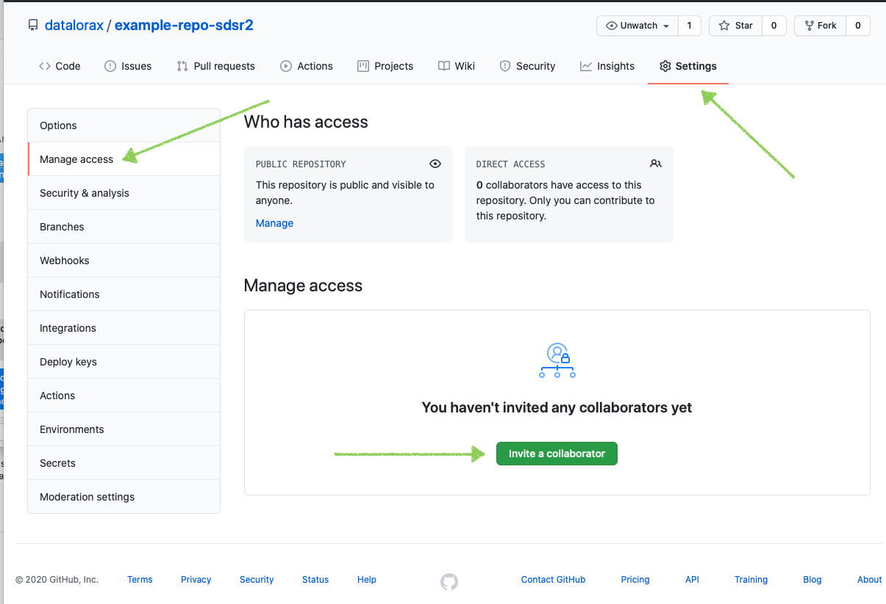

```{r setup, include=FALSE}
knitr::opts_chunk$set(echo = FALSE)
```

# Cómo usar Git/GitHub con R

El uso de Git y GitHub junto con RStudio tiene el poder de revolucionar la forma en que trabajas en R. Pero configurar todo puede ser un desafío.

## 1. ¿Qué es Git? ¿Qué es GitHub?

En primer lugar, son dos cosas separadas:

1.  Git es un software de código abierto para el control de versiones. Utilizando Git, puedes hacer cosas como ver todas las versiones anteriores de código que has creado en un proyecto.

2.  GitHub es el servicio más popular (otros incluyen GitLab y BitBucket) para colaborar en código y archivos usando Git.

Es posible usar Git sin usar GitHub, aunque la mayoría de la gente combina los dos. Poder tener un registro de todos los cambios que ha realizado en su código tanto localmente como en un sitio web remoto es poderoso.

### ¿Por qué debería usar Git y GitHub?

1.  **El uso de Git y GitHub sirve como copia de seguridad**.

2.  **El uso de Git y GitHub te permite usar el control de versiones**

3.  **El uso de Git y GitHub permite trabajar en el mismo proyecto al mismo tiempo que los colaboradores.**

## 2. Cómo configurar Git

Ahora que tienes un poco más de comprensión de lo que son Git y GitHub, hablemos de cómo configurar todo. Gran parte de lo que compartiré proviene del excelente libro [Happy Git with R](http://happygitwithr.com/) de Jenny Bryan y Jim Hester. Sin embargo, en el momento de escribir este artículo (febrero de 2021), algunas cosas han cambiado con respecto a las credenciales. Adorno lo que creo que es el consejo más actualizado para configurar todo.

### 2.1 Configurar Git (Editar gitconfig file) desde Rstudio

Primero abrímos un nuevo proyecto de Rstudio para configurar Git y Github

El siguiente paso es configurar Git. Esto se trata en el [Capítulo 7 de Happy Git with R](https://happygitwithr.com/hello-git.html), aunque muestro lo que creo que es un proceso un poco más fácil. Específicamente, sugiero usar la función [edit_git_config() del paquete usethis](https://usethis.r-lib.org/reference/edit.html), que abrirá su [archivo gitconfig](https://git-scm.com/book/en/v2/Getting-Started-First-Time-Git-Setup). Agregue su nombre y correo electrónico y cierre esto

En la consola de RStudio:

```{r echo=TRUE, eval = FALSE}

install.packages(usethis) #instala el paquete usethis

library(usethis)
usethis::edit_git_config()
# Modificar en el fichero ".gitconfig" los apartados: "name" y "email" 

#Pegar en ".gitconfig" lo siguiente (y luego quitar las #):

#[filter "lfs"]
#	  clean = git-lfs clean -- %f
#	  smudge = git-lfs smudge -- %f
#	  process = git-lfs filter-process
#	  required = true
#[user]
#	name = minombredeusuario
#	email = micorreo@gmail.com
#[credential]
#	helper = cache

# complete con su nombre de usuario y email
# y guardar el fichero
```

## 3. Conectar RStudio y GitHub

El proceso hasta ahora nos ha permitido usar Git localmente. Pero, ¿qué pasa si queremos conectarnos a GitHub? ¿Cómo lo hacemos?

### 3.1 Regístrate en GitHub

El primer paso es [registrarse para obtener una cuenta (gratuita) de GitHub](https://github.com/join).

### 3.2 Crear un token de acceso personal (PAT) en GitHub

Una vez que se haya registrado, deberá habilitar RStudio para hablar con GitHub. La mejor manera de conectar RStudio y GitHub es usando su nombre de usuario y un token de acceso personal (PAT). Para generar un token de acceso personal, use la función [create_github_token() de usethis](https://usethis.r-lib.org/reference/github-token.html). Esto lo llevará a la página correspondiente en el sitio web de GitHub, donde le dará un nombre a su token y lo copiará (¡no lo pierda porque nunca volverá a aparecer!).

En la consola de RStudio:

```{r echo=TRUE, eval = FALSE}
library(usethis)
usethis::create_github_token()
```

-   Pulsar sobre el enlace que aparece en la salida en la consola.

-   Abrirá una página web de Github en la que se tendrá que pulsar el botón "Generate token".

-   Copiar el token que aparece en Github (luego se utilizará en el siguiente paso).

### 3.3 Almacenar token de acceso personal para conectar RStudio y GitHub

Ahora que ha creado un token de acceso personal, debemos almacenarlo para que RStudio pueda acceder a él y sepa conectarse a su cuenta de GitHub. La función [gitcreds_set() del paquete gitcreds](https://gitcreds.r-lib.org/reference/gitcreds_get.html) te ayudará aquí. Ingresará su nombre de usuario de GitHub y el token de acceso personal como contraseña (NO su contraseña de GitHub). Una vez que haya hecho todo esto, ¡habrá conectado RStudio a GitHub!

En la consola de RStudio:

```{r echo=TRUE, eval = FALSE}
install.packages("gitcreds")
library(gitcreds)
gitcreds::gitcreds_set()
# Ante la pregunta: "Enter password or token"
# introducir el token copiado en el paso anterior
```

Y/O guarda el token en .Renviron

```{r echo=TRUE, eval = FALSE}

usethis::edit_r_environ()

#  GITHUB_TOKEN="MI_TOKEN"

```

Reinicia R y verifica la configuración.

```{r echo=TRUE, eval = FALSE}

usethis::git_sitrep()

```

Si queremos ver el token en .Renviron, volvemos a ejecutar (muy importante porque Rstudio nos puede pedir el nombre de usuario de Github y TOKEN cada cierto tiempo cada vez que hacemos un **Commit**)

```{r echo=TRUE, eval = FALSE}

usethis::edit_r_environ()

```


Si todo ha salido bien salte al **apartado 5** del manú

## 4. Manual de sobreviviencia con Git y GitHub en RStudio

Erick Cuevas-Fernández

10 de agosto de 2021

-   Este documento se basa en "Happy Git with R" de Jenny Bryan y los STAT 545 TAs, Jim Hester

### 4.1 Encuentre a Git usted mismo

RStudio sólo puede actuar como un GUI front-end para Git, si Git se ha instalado correctamente **RStudio puede encontrarlo**.

Una prueba básica para la instalación exitosa de Git es simplemente introducir `git` en el shell. Si recibe una queja sobre que Git no se encuentra, significa que la instalación no tuvo éxito o que no se encuentra, es decir, no está en su `PATH`.

Por cualquier problema con la conexión entre RStudio y Git, siempre ten en cuenta la ubicación de dónde se instaló Git.

-   Puedes usar en la terminal `which git` (Mac y Linux)

-   O bien usar en la terminal `where git` (Windows)

-   Recuerda que la terminal (o línea de comandos ó consola ó `shell` ó `bash`) es un programa en tu computadora que funciona para correr otros programas. Desde RStudio puedes abrir la **terminal**, lo cual es muy conveniente si estás trabajando en un proyecto. Puedes abrir una terminal con:

    -   *`Tools > Terminal`* (abre la terminal dentro del IDE de RStudio)

    -   *`Tools > Shell`*(abre una terminal externa a RStudio)

-   La recomendación actual de **GitHub** es usar *HTTPS* porque es la manera más fácil de configurar y tiene operabilidad en multiples redes y plataformas.

    -   Es menos probable que HTTPS sea bloqueado por un firewall.

    -   Una conexión HTTPS permite que `credential.helper` almacene en caché su contraseña. (por tanto puedes configurar tu usuario y contraseña en tu equipo de uso)

    -   Es más sencillo acceder a un repositorio desde cualquier lugar, ya que solo necesita los detalles de su cuenta (no se requieren claves SSH) para escribir en el repositorio.

-   Usualmente cuando inicies un proyecto colaborativo con GitHub inicializa el repositorio con un README. Copia el HTTPS URL para clonar el repositorio en la *terminal* `git clone https://github.com/TU-USUARIO/`

### 4.2 Dígale a RStudio dónde encontrar a Git

Si Git parece estar instalado y se puede encontrar, inicie RStudio. Salga y vuelva a iniciar RStudio si **hay alguna duda** sobre si abrió RStudio antes o después de instalar Git. HÁGALO.

Desde RStudio, vaya a *`Tools> Global Options> Git/SVN`* y asegúrese de que la casilla \* Git executable \* apunte a ... el ejecutable de Git. Debe leer algo como:

-   `/usr/bin/git` (Mac, Linux)

-   `C:/Program Files (x86)/Git/bin/git.exe` (Windows)

Aquí hay un [screenshot](http://www.molecularecologist.com/wp-content/uploads/2013/11/Screenshot-2013-11-12-09.53.56-Copy1.png) de alguien que hace esto en un computador con Linux.

{width="1020"}

-   **ATENCIÓN**: En Windows, **NO** use `C:/Program Files (x86)/Git/cmd/git.exe`. `bin` en el path está BIEN, ¡SÍ! `cmd` en el path está MAL, ¡NO!

-   **ATENCIÓN**: En Windows, **NO** use `git-bash.exe`. Algo que termine en `git.exe` está BIEN, ¡SÍ! `git-bash.exe` está MAL, ¡NO!

-   A veces, se han tenido problemas para navegar hasta el directorio necesario en Mac OS, una vez que se ha hecho clic en "Browse" y trabajando con una ventana deL Finder. El atajo de teclado es "command + shift + g" invocará "Go To Folder", donde podrá escribir o pegar cualquier ruta que desee.

**Reinicie RStudio si realiza cambios.** HÁGALO

Siga los pasos de arriba para ver si RStudio y git se están comunicando ahora.

¿No está contento?

-   Se ha visto esta ayuda: con su Proyecto abierto, vaya a "Tools\>Project Options ...". Si está disponible, haga clic en "Git/SVN" y seleccione "Git" en el menú desplegable Sistema de control de versiones. Responda "yes" a la ventana emergente "Confirm New Git Repository". Responda "yes" a la ventana emergente "Confirm Restart RStudio".

-   Si instaló Git a través de GitHub para Windows, es posible que el ejecutable de Git esté realmente bien oculto. Obtenga ayuda o instale Git de otra manera.

-   Su `PATH` probablemente no está configurado correctamente y/o debe reinstalar Git y controlar/notificar a dónde va. Lea más en [15](https://mamaciasq.github.io/git-con-r/troubleshooting.html#troubleshooting).

-   Pida ayuda.

### 4.3 Problemas y soluciones RStudio, Git, GitHub

Problemas que se han visto y posibles soluciones.

Si experimenta algún problema nuevo y, sobre todo, encuentra la solución correspondiente, [se apreciará mucho saber de usted!](https://github.com/jennybc/happy-git-with-r/issues)

#### 4.3.1 El panel de Git de RStudio desaparece en Mac OS

Después de una actualización de Mac OS, es posible que deba activar las herramientas de línea de comandos de Xcode para solicitarle lo que necesita, es decir, volver a instalar o volver a aceptar el acuerdo de licencia. Hemos visto que esto provoca que el panel de RStudio Git desaparezca en un sistema donde estaba funcionando anteriormente. Use comandos como estos a continuación para hacerle cosquillas a Xcode:

```{bash echo=TRUE, eval = FALSE}

xcode-select --install

```

o

```{bash echo=TRUE, eval = FALSE}

git config --global --list

```

Luego **reinicie RStudio**.

#### 4.3.2 PATH disfuncional

Es bastante seguro de que la mayoría de los casos en los que RStudio *no* detecta automáticamente el ejecutable de Git provienen de problemas con el `PATH`. Este es el conjunto de directorios donde la computadora buscará ejecutables, como Git (hoy) o `make`. Ciertos métodos de instalación de Git, especialmente en Windows y/o sistemas operativos más antiguos, tienen una mayor tendencia a poner Git en una ubicación no convencional o dejar de agregar el directorio correspondiente al `PATH`.

¿Cómo ver su `PATH`?

En el shell:

```{bash echo=TRUE, eval = FALSE}

echo $PATH

```

Eche un buen vistazo a eso. Vea el punto anterior sobre cómo encontrar su ejecutable Git o reinstalarlo mientras está **completamente despierto**. ¿El directorio de host está en su `PATH`? ¿No? **Arréglelo**

Vaya [aquí](http://www.troubleshooters.com/linux/prepostpath.htm) para obtener instrucciones sobre qué poner en su `.bash_profile` para añadir un directorio al `PATH`.

#### 4.3.3 Botones Push/Pull atenuados en RStudio

¿Está seguro de que su repositorio local está rastreando un repositorio remoto, por ejemplo, un repositorio de GitHub? En un shell con directorio de trabajo configurado en el repositorio local de Git, ingrese estos comandos:

```{bash echo=TRUE, eval = FALSE}
brereton@2021-mbp myrepo $ git remote -v 
origin  https://github.com/jennybc/myrepo (fetch)
origin  https://github.com/jennybc/myrepo (push)
```

Queremos ver que fetch y push estén configurados en URL remotas que apuntan al repositorio remoto. Tenga en cuenta también que el repositorio de GitHub es un remoto llamado `origen`, en lo que respecta a su repositorio local. Esto es típico y, aunque creo que `github` es un nombre muy superior, el `origen` es una convención tan fuerte que lo sigo.

Si descubre que todavía necesita configurar un control remoto, obtenga la URL HTTPS o SSH, según corresponda, para su repositorio GitHub. Esto es fácil de obtener en su portapapeles desde la página GitHub del repositorio. Haz esto en el shell:

```{bash echo=TRUE, eval = FALSE}
git remote add origin https://github.com/brereton/myrepo.git
```

Descargue todos los archivos del repositorio GitHub en línea y haga frente a cualquier conflicto.

```{bash echo=TRUE, eval = FALSE}
git pull origin master
```

Llame a `git remote -v` nuevamente. Una vez que pueda probar que su control remoto GitHub está configurado correctamente, puede pasar al siguiente paso.

¿Estás seguro de que la sucursal actual está *rastreando* una sucursal en el control remoto? En ese mismo shell, en su repositorio, haga esto:

```{bash echo=TRUE, eval = FALSE}

brereton@2021-mbp myrepo $ git branch -vv
* master b8e03e3 [origin/master] line added locally

```

Lo anterior muestra la confirmación exitosa de que la rama `master` local está rastreando `origin/master`, es decir, la rama principal en GitHub. Si no ve el bit `[origin/master]`, eso es un problema. Por cierto, `git branch -r` es otra forma útil de examinar las ramas de seguimiento remoto. (Si está trabajando con una rama que no sea `master`, ajuste todo en consecuencia).

Al conectar un repositorio local a un nuevo repositorio de GitHub, mucha gente recuerda agregar el control remoto GitHub, pero también se olvida de consolidar esta relación de seguimiento para las sucursales relevantes.

Si descubres que la rama `master` local todavía no está siguiendo 'master\` en GitHub, corrige eso de la siguiente manera:

```{bash echo=TRUE, eval = FALSE}

git push --set-upstream origin master

```

Esto es equivalente a `git push -u origin master`, pero transmite más acerca de lo que está haciendo.

Llame `git branch -vv` o `git branch -r` nuevamente para confirmar que la rama `master` en GitHub es la rama ascendente o de seguimiento para la rama`master` local.

#### 4.3.4 Falla en el push a nivel de RStudio

¿Obtiene este error en RStudio?

```{bash echo=TRUE, eval = FALSE}

error: unable to read askpass response from 'rpostback-askpass'

```

Abra el shell: *Tools \> Shell*.

```{bash echo=TRUE, eval = FALSE}


git push -u origin master


```

#### 4.3.5 Se rumorea que tiene algún repositorio de Git dentro de otro repositorio de Git

No cree un repositorio de Git dentro de otro repositorio de Git. Simplemente no lo haga.

Si tiene una necesidad real de esto, lo que es realmente raro, la forma correcta de hacerlo es a través de [submódulos](http://git-scm.com/book/en/v2/Git-Tools-Submodules).

## 5. Inicializar un repositorio Git

Ahora que ha instalado y configurado Git, puede usarlo localmente. La [función use_git()](https://usethis.r-lib.org/reference/use_git.html) agregará un repositorio Git (a menudo denominado "repositorio") a un proyecto RStudio existente. Aquí crearé un nuevo proyecto y luego inicializaré un repositorio de Git.

En RStudio:

-   Crear un `Nuevo Proyecto` en el menu `File`

-   Seleccionar `"New Directory"`

-   Seleccionar `"New Project"`

-   En crear nuevo proyecto, selecciones:

    -   Activar: `"Create a git repository"`

{width="820"}

En la consola de RStudio:

```{r echo=TRUE, eval = FALSE}


library(usethis)
usethis::use_git()
# Elegir siempre la opción: 1
# Y ante la ventana, seleccionar: "Save"


```

Y visitar la pestaña: `"Git"` en RStudio.

{width="826"}

En RStudio ve a *`Tools > Project Options > Git/SVN`*. Dentro de *Version control system*, selecciona *Git*. Y da click a *"Yes"* cuando aparezca *"Confirm New Git Repository?"*.

Si usaste RStudio o *usethis*, el proyecto debería reiniciarse en RStudio. Hazlo tu mismo si hizo git init. RStudio ahora debería tener un panel Git.

## 6. Ver historial de confirmación

Ahora que mi proyecto RStudio tiene un repositorio Git asociado, veré una pestaña adicional en la parte superior derecha: la pestaña Git. Desde aquí, puedo ver todo el historial de cambios en mi código a lo largo del tiempo (¡todavía no muchos!).

En RStudio:

-   Visitar la pestaña: "Git" de RStudio

-   Pulsar el icono del reloj para ver el historial de "Commit" realizados para ver el "Initial Commit".

{width="1200"}

## 7. Haga una consolidación o confirmación (commit) y vea más historia

Git no realiza un seguimiento automático de los cambios de la manera en que lo hace una herramienta como Google Docs. En su lugar, tienes que decirle a Git: hice cambios y quiero que mantengas un registro de ellos. Decirle a Git esto se llama hacer una confirmación (commit) y puedes hacerlo desde RStudio.

Cada confirmación tiene un mensaje de confirmación, lo que es útil porque, cuando miras tu historial de código, ves lo que hiciste en cada momento (es decir, en cada confirmación o commit). RStudio tiene una herramienta integrada para ver su historial de código. Puede hacer clic en cualquier confirmación para ver qué cambió, en relación con la confirmación anterior. Se agregaron líneas en verde; se eliminaron líneas en rojo.

Un ejemplo practico, en RStudio realice lo siguiente:

-   Crear un archivo de script R: llámelo "test.R" y guardelo.

-   Visite la pestaña "Git" de RStudio y pulse sobre el botón de "commit" para confirmar la creación del archivo (fichero): "test.R".

-   En el panel del commit añada un texto que lo defina, por ejemplo; Mi primer script R.

-   Haga varios cambios en el fichero "test.R" y haga en cada uno de ellos de nuevo un "commit".

-   Revise luego la historia de los cambios que se han producido en el historial (pulsar el icono del reloj).

    -   Observe los nuevos cambios resaltados en color verde.

    -   Frente a los valores antiguos que aparecerán en color rojizo.

## 8. Cómo conectar proyectos de RStudio con repositorios de GitHub

Ahora que hemos conectado RStudio y GitHub, discutamos cómo hacer que los dos funcionen juntos. La idea básica es que configure los proyectos que cree en RStudio con repositorios GitHub asociados. Cada proyecto de RStudio vive en un solo repositorio de GitHub.

¿Cómo conectamos un proyecto de RStudio a un repositorio de GitHub? [Happy Git with R repasa tres estrategias](https://happygitwithr.com/usage-intro.html). Demostraré dos de ellos.

### 8.1 RStudio Primero

A veces, ya tiene un proyecto localmente y desea obtenerlo en GitHub. Para hacer esto, primero deberá usar la función [use_git() de usethis](https://usethis.r-lib.org/reference/use_git.html), como hicimos anteriormente. Luego, puede usar la [función use_github()](https://usethis.r-lib.org/reference/use_github.html), que creará un repositorio de GitHub y lo conectará a su proyecto RStudio actual.

Para subir un proyecto RStudio en el que se ha configurado las opciones con Git a Github, se tienen que realizar los siguientes pasos en la consola de RStudio:

```{r echo=TRUE, eval = FALSE}
library(usethis)
usethis::use_git()
#hacer un commit
usethis::use_github()
#pedira nombre de usuario y token (ver usethis::edit_r_environ())
```

-   Se realizará un proceso que activará la página web de Github con el repositorio asociado al proyecto que se acaba de crear en RStudio.

### 8.2 GitHub Primero

La forma más sencilla de usar RStudio y GitHub juntos es crear un repositorio en GitHub primero. Cree el repositorio y, a continuación, cuando inicie un nuevo proyecto en RStudio, utilice la opción de control de versiones, introduzca la URL de su repositorio y listo.

Para bajar un repositorio creado en Github a un proyecto local en RStudio, se tienen que realizar los siguientes pasos:

-   Crear un nuevo repositorio en nuestra cuenta de Github (o utilizar uno ya existente): pulsar el botón "Create repository".

-   Copiar al portapapeles (`clonar`) la primera dirección que aparece (pulsando el botón de la derecha). Coincide con la dirección url que aparece en la barra del navegador.

-   En RStudio seleccionamos crear "New project", elegimos `"Version Control"` y luego seleccionamos "Git".

-   Introducimos en el primer cuadro de texto la url copiada anteriormente.

-   Pulsamos `"Create Project"`.

-   A continuación podrá consultarse la pestaña "Git" y ver la información asociada al repositorio descargado.

## 9. Flujo de trabajo general

Ahora que hemos conectado RStudio y GitHub, podemos empujar y tirar de nuestro trabajo entre los dos.

### 9.1 Push (Subir a Github)

Empujar significa enviar cualquier cambio en su código de RStudio a GitHub. Para hacer esto, primero tenemos que comprometernos. Después de confirmar, ahora tenemos un botón (la flecha hacia arriba) en RStudio que podemos usar para enviar nuestro código a GitHub.

En RStudio:

-   Creamos un nuevo archivo ("fichero") en "File"; un script R o un archivo .Rmd y lo guradamos.

-   Se pulsa en la pestaña "Git" sobre el botón de "commit".

-   Marcamos todos los ficheros sobre los checks de "Staged", rellenamos la descripción del commit y pulsamos sobre el botón de "commit".

-   Después de hacer el commit, pulsamos sobre el botón "Push" para subir los cambios a Github.

-   A continuación puede comprobarse en la página de Github del repositorio que se han actualizado los últimos ficheros considerados en el último commit.

### 9.2 Pull (Descargar desde Github)

Lo opuesto a empujar es tirar (Pull). Utilizando el botón de flecha hacia abajo, RStudio va al repositorio de GitHub, toma el código más reciente y lo lleva a su editor local. ([Tirar regularmente es extremadamente importante si estás colaborando](https://medium.com/better-programming/six-rules-for-good-git-hygiene-5006cf9e9e2#:~:text=Always%20Pull%20Before%20a%20Push&text=Before%20you%20try%20to%20push,sync%20with%20the%20remote%20repository.), aunque si eres el único que trabaja en un proyecto de RStudio y un repositorio GitHub asociado, sabes que tu código local coincide con lo que está en GitHub, por lo que es menos importante.)

En la página de Github de nuestro repositorio:

-   Editamos uno de los ficheros de nuestro repositorio pulsando sobre el icono de un lápiz (a la derecha).

-   Realizamos alguna modificación sobre el fichero (o ficheros).

-   Pulsamos en la parte inferior de la página en el botón de "Commit changes" (rellenando los comentarios que creamos oportunos sobre el commit que se está realizando).

-   Se puede navegar por la página de Github para consultar todos los commits realizados (y mucha más información).

Volvemos a RStudio:

-   En la pestaña "Git" pulsamos sobre el botón de la flecha que apunta hacia abajo (verde) para realizar un "Pull" o descarga de los cambios en Github a nuestro proyecto local en RStudio.

-   Después de eso puede comprobarse que los ficheros locales de nuestro proyecto se han actualizado con los cambios que se han producido en el repositorio.

**¡Lo hiciste!**

¡Ahora está todo configurado para usar Git y GitHub con RStudio!

## 10. Colaborando con Git y Github

Este artículo es una traducción automática del artículo: <https://www.sds.pub/collaborating-with-git-and-github.html>

Cualquiera que haya trabajado alguna vez en cualquier tipo de proyecto de escritura colaborativa (código o de otro tipo) probablemente se ha encontrado con frustraciones del control de versiones. Por ejemplo, podría estar trabajando en algunas revisiones de un documento. Hago algunas modificaciones y se las envío a mi colega. En el momento en que obtienen mi versión, sin embargo, ya está detrás de su versión en otras áreas (por ejemplo, tal vez revisaron su descripción del análisis al mismo tiempo que proporcioné modificaciones al documento en su totalidad). No pueden simplemente aceptar mis ediciones sin perder otros cambios, pero les gustaría incorporar ambos cambios. En muchas situaciones como esta, el control de versiones se maneja mediante convenciones de nomenclatura, por ejemplo, 'full-manuscript_v1.docx' se convierte en 'full-manuscript_v1da.docx' que luego se convierte en 'full-manuscript_v2.docx' hasta que finalmente terminamos con 'full-manuscript_vFinal.docx' que inevitablemente termina como 'full-manuscript_vFinalv2.docx' y así sucesivamente hasta que realmente llamemos al documento completo. Git es un enfoque alternativo para administrar versiones de un documento mediante el seguimiento de los cambios en las líneas de los documentos. Si dos personas están trabajando en el mismo documento, pero editando líneas diferentes, esos cambios se fusionarán automáticamente. Sin embargo, fundamentalmente, no se pierde nada y la historia completa del proyecto se almacena desde su creación inicial hasta las etapas finales. Git se creó inicialmente para desarrolladores de software, pero abogamos por su uso para una gama más amplia de aplicaciones, incluidos documentos dinámicos. (es decir, cualquier cosa producida a través de RMarkdown). Desde nuestro punto de vista, la curva de aprendizaje de git es engañosamente empinada. A menudo vemos que las discusiones sobre git son simples (por ejemplo, 'aprenda estos cinco comandos para trabajar con git') con poca instrucción explícita dedicada al tema. Más bien, es una habilidad que se presume que uno 'adquirirá' en el camino. Si bien hay excepciones a esto (por ejemplo, el maravilloso libro Happy Git y GitHub para el usuario de Jenny Bryan), sentimos que es importante cubrir el tema de manera explícita.

### 10.1 Colaborando

Una de las ventajas de utilizar git es que proporciona un medio eficaz de colaboración. Sin embargo, no cualquiera puede contribuir directamente a su repositorio. Hay dos formas principales de colaborar en un repositorio con colegas: (a) agregar colaboradores a un repositorio existente, o (b) crear una organización y agregar colaboradores a repositorios específicos, o la organización en su conjunto. La principal diferencia entre estos es que las organizaciones suelen tener muchos repositorios y usted puede otorgar acceso a todos los repositorios simultáneamente. Podría considerar crear una organización para todo su laboratorio, por ejemplo, y luego tener diferentes repositorios para diferentes proyectos. Sin embargo, incluso dentro de las organizaciones, puede agregar colaboradores a repositorios individuales sin proporcionar acceso a toda la organización.

Para agregar colaboradores a un repositorio, vaya a Settings -\> Manage Access -\> Invite a collaborato

{width="1005"}

Luego, puede buscar personas por su nombre de usuario de GitHub, correo electrónico o su nombre / apellido. Una vez que se envía una invitación, la persona debe aceptar la invitación y luego tendrá acceso push al repositorio. Los colaboradores generalmente deben reservarse para personas que tienen roles continuos en el proyecto, con contribuciones directas. Las pequeñas correcciones de errores, etc., se pueden manejar con forks (bifurcaciones) de repositorio (descritas a continuación).

### 10.2 Branching

La ramificación es un marco realmente poderoso para trabajar con git, y le sugerimos que se sienta cómodo lo antes posible. Cuando crea una rama, crea efectivamente una copia paralela de todo el repositorio. Puede realizar los cambios que desee en esa rama y estar seguro de que no romperá nada en la rama principal porque está completamente separada. Una vez que haya creado lo que sea en lo que estaba trabajando en su rama, y ​​haya decidido con sus colaboradores que debería ser parte de la rama principal, puede fusionarlo. Alternativamente, puede decidir que no quiere para hacer esos cambios, y luego puede simplemente tirar la rama a la basura y seguir adelante sin ninguna interrupción en la main branch. Como regla general, debe intentar nunca realizar cambios directamente en la rama principal. En su lugar, cree branches, realice cambios allí y luego combínelas. Esto ayuda a garantizar que los cambios se implementen en la main branch de una manera planificada, y puede usar sistemas de revisión con sus colegas para asegurarse de que todos estén en sintonía.

## Más información

Si estás buscando aprender más y aún no te he ganado la idea de que deberías echar un vistazo a Happy Git with R, [déjame intentarlo una vez más](http://happygitwithr.com/). Es el mejor libro para ayudarte a guiarte a medida que profundizas en el uso de Git/GitHub en tu trabajo de R.

Aquí hay algunos recursos adicionales de Git/GitHub para revisar:

[Colaboración con git y GitHub](https://www.sds.pub/collaborating-with-git-and-github.html): Este capítulo de los materiales del curso para Social Data Science with R en la Universidad de Oregon cubre los conceptos básicos de Git y GitHub.

[Los materiales de un taller de rstudio::conf de 2019](https://rstudio-conf-2020.github.io/r-for-excel/github.html) titulado "R para usuarios de Excel" cubren "control de versiones y practica un flujo de trabajo con GitHub y RStudio que optimiza el trabajo con nuestro colaborador más importante: Future You".
